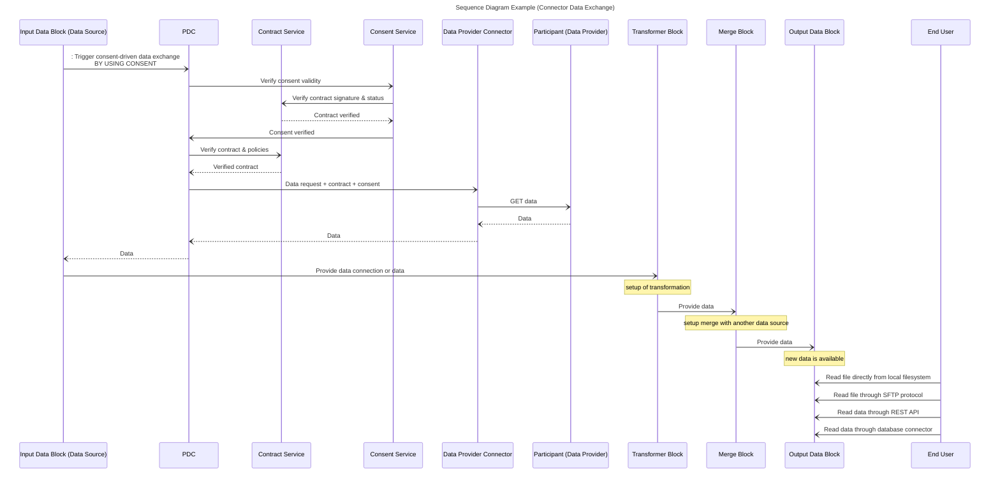
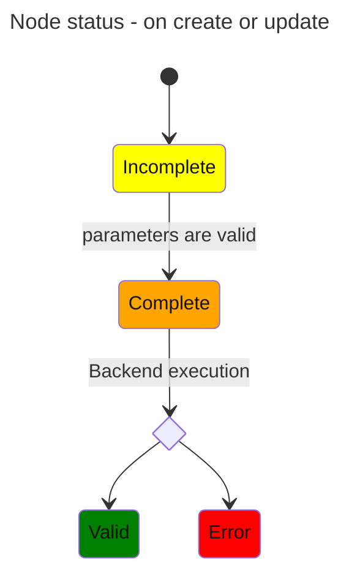
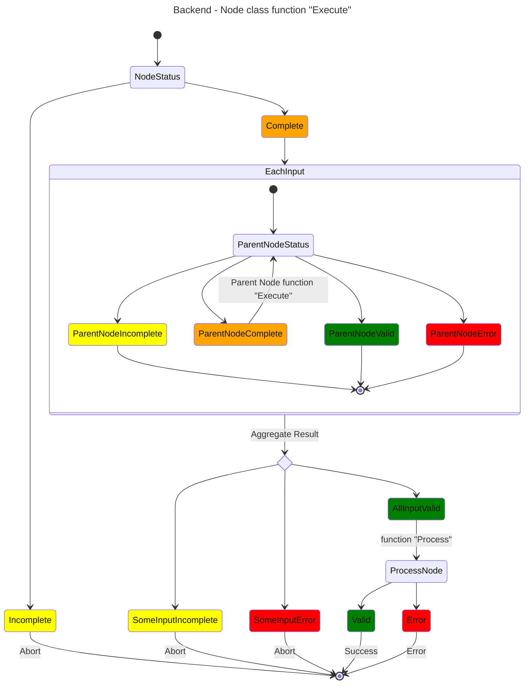

# Data Alignment, Aggregation and Vectorisation (DAAV) BB – Design Document


The DAAV building block purpose is to setup **data manipulation pipeline** to create new dataset by :

- combining data from various source
- filtering them to create subset
- converting them from one format to another
- calculating new data


The project is divided in two modules :

- The front-end  offers a user interface to connect various data sources (Prometheus Data Connector, databases, files, API), visualize them and manipulate them (alignment, aggregation and vectorisation). The data manipulation use a **visual programming system** to create data manipulation pipelines by connecting blocks. Basic roles / organisations / users managment is available.
- The back-end provides API to manage front-end actions, to execute the data manipulation and to expose data.

Blocks are divided in three groups :

- Input block : Each block represent a dataset from Prometheus dataspace or external source.
- Transform block : Can manipulate and transform data.
- Output block : Can store the result and/or expose the new dataset on Prometheus dataspace.

## Technical usage scenarios & Features

The first main objective of this building block is to reduce entry barriers for data providers and ai services clients by simplifying the handling of heterogeneous data and conversion to standard or service-specific formats.

The second main objective is to simplify and optimize data management and analysis in complex environments.

### Features/main functionalities

Create a connector from any input data model to any output model. Examples :

- xApi custom model to xApi standardized model
- Research datasets (Mnist, commonvoice, etc…)  to custom vector
- Custom skills framework to any framework
- Subset of main dataset

Create a aggregator from different data sources : 

- link pseudonymised data with identification data for customer followup
- mix data of various subcontractors for global overview

Receive pushed data from PDC.

Tools to describe and explore datasets.

Expert system and AI automatic data alignment.

### Technical usage scenarios

1. Creation of a new dataset from different sources
    1. Aggregation of data from multiple sources ensuring data compatibility and standardization.This is useful for data analysts who often work with fragmented datasets.
    2. Providing mechanism to transform and standardize data formats, such as converting xAPI data to a standardized xAPI format.
    3. Merging datasets with different competency frameworks to create a unified model.
    4. Optimize data manipulation and freshness based on user’s needs.
2. Give access to specific data based on user rights (contracts and organisation roles)
    1. Paul is CMO and wants to follow KPIs on each products of his entreprise. He was access to specific data prepared by his IT team
    2. Arsen is fullstack developper and wants to verify integrity of data generated by his code. He configures his own data to this purpose.
    3. Christophe is an AI developer and wants to prepare his data for training. He create pipelines with continuous integration.
    4. Fatim is a data analyst and has been given access to a dataset to calculate specific metrics : mean, quantile, min, max, etc. 
3. Manage inputs and outputs for others building blocks or AI services. 
    1. Prepare data for Distributed Data Visualization.
    2. Prepare input and receive (and store) output for Data Veracity and Edge translators.
    3. Create subsets of a main dataset to test performance of an AI service on each set.

- Front-end : User can retrieve Prometheus-X dataspace ressource or add external ressource and build a transformation workflow from it.
- Back-end : Expose a public endpoint to execute transformation workflow or to get data ; Script-oriented automation ;
- Database : Internal database of the building block to store user ressource location and workflow.

## Requirements

BB must communicate with catalog API to retrieve contract.

BB must communicate with pdc to trigger data exchange with pdc.

BB MUST communicate to PDC to get data from contract and consent BB.

BB CAN receive data pushed by PDC.

BB CAN connect to others BB.

BB MUST expose endpoints to communicate with others BB.

BB SHOULD be able to process any type of data as inputs

Expected requests time : 

| Type | Requests |
| --- | --- |
| Simple request | < 100ms |
| Medium request | < 3000ms |
| Large requests  | < 10000ms |

## Integrations

### Direct Integrations with Other BBs

No other building block interacting with this building block requires specific integration.

## Relevant Standards

### Data Format Standards

JSON - CSV - NoSQL (mongo, elasticsearch) - SQL - xAPI - Parquet - Archive (tar, zip, 7z, rar).

### Mapping to Data Space Reference Architecture Models

DSSC :

- **Data Interoperability /** [Data Exchange](https://dssc.eu/space/BVE/357075193): capabilities relating to the actual exchange and sharing of data.
- **Data Sovereignty and Trust /**
- **Data Value Creation Enablers /**
    - [Data, Services and Offering Descriptions](https://dssc.eu/space/BVE/357075789): this building block provides data providers with the tools to describe data, services and offerings appropriately, thoroughly, and in a manner that will be understandable by any participant in the data space. It also includes related data policies and how they can be obtained.
    - [Publication and Discovery](https://dssc.eu/space/BVE/357076320): this building block allows data providers to publish the description of their data, services and offerings so that they can be discovered by future potential users, following the FAIR (Findable, Accessible, Interoperable and Reusable) principles as much as possible.
    - [Value-Added Services](https://dssc.eu/space/BVE/357076468)[:](https://dataspacessupportcentre.atlassian.net/wiki/spaces/BV/pages/143720695/Marketplaces+Usage+Accounting) this building block complements the data space enabling services by providing additional services to create value on top of data transactions. These services are structured capabilities to facilitate certain tasks, processes, or functions that these users need, directly or indirectly, for their operations.

[*IDS RAM](https://docs.internationaldataspaces.org/ids-knowledgebase/v/ids-ram-4/)* **4.3.3 Data as an Economic Good**

## Input / Output Data


## Project interface

Project interface handle all requires information for a DAAV project.
The front-end can import and export json content who follows this structure.

The back-end can execute the workflow describe in this structure.
Inside we have Data Connectors required to connect to a datasource.

A workflow is represented by nodes (Node) with input and output (NodePort) who can be connected.
All nodes are divides in  three group :
- Input Node for data sources.
- Transform node to manipulate data.
- Output node to export newly created data.


This may be for a complete run, or simply to test a single node in the chain to ensure hierarchical dependency between connected nodes.

## Architecture


### Front-end worflow editor class diagram

This diagram describes the basic architecture of the front-end, whose purpose is to model a set of tools for the user, where he can build a processing chain.

This is based on Rete.js, a framework for creating processing-oriented node-based editors.

A workflow is a group of nodes connected by ports (input/output) each ports have a socket type who define the data format which can go through and so define connection rules between node.


Example of a node base editor with nodes and inside inputs and/or output and a colored indicator to visualize its status.


### Back-end workflow class diagram

The back-end class, which reconstructs a representation of the defined workflow and executes the processing chain, taking dependencies into account.

For each node, we know its type, and therefore its associated processing, as well as its inputs and outputs, and the internal attributes defined by the user via the interface.


## Dynamic Behaviour

The sequence diagram shows how the component communicates with other components.





**Backend Node Execute** : Node mother class function  "execute"
Each child class have its function "Process" with specific treatment.

Inside a workflow a recursive pattern propagate the execution following parents nodes.



## Configuration and deployment settings
Various configuration example :

```html
**.env file :** 
MONGO_URI = ''
SQL_HOST = ''

LOG_FILE = "logs/log.txt"
...

**secrets folder (openssl password generated) :** 
- secrets/db_root_password 
- secrets/elasticsearch_admin

**angular environments :** 
- production: true / false
- version : X.X

**python fast api backend config.ini :**
[dev]
DEBUG=True/False

[edge]
master:True/False
cluster=014
```

*What are the limits in terms of usage (e.g. number of requests, size of dataset, etc.)?*

```bash
# work in progress
```

## Third Party Components & Licenses

- retejs MIT license
- ionic/angular/material MIT license
- FastAPI MIT license
- DuckDB MIT license
- PyArrows Apache License


## Implementation Details

### Nodes implementation :

All nodes have a front-end implementation where the user can setup its configuration and a back-end implementation to execute the process.

All nodes inherit from the abstract class Nodeblock.

We identify shared functionalities like :

- Front-end : a status component to track the node status with a visual indicator.
- Front-end : a data method to save the current node configuration with user modification.
- Front-end : a run button to execute the node.
- Back-end : An execute function to verify parent status and executed them if possible to finally call her inner logic.
- Back-end : An abstract process function with custom business logic

**Inputs Node  :**

All input nodes inherit from InputDataBlock :

We identify shared functionalities like :

- Front-end : button to test the connection with the data-source with a visual indicator.
- Back-end : An abstract test connection function.

We need one class of input Node for each data-source format (Local file, MySQL, Mongo , API, ...)

For the front-end a factory deduces the correct input instance according to the given source connector sent in parameter.

Node instance exposes one output and its socket type define its format :
- Flat object  : Table of data with several columns. Examples : CSV, MySQL results
- Deep object : Collection of data with inner objects.
- xAPI : Deep object who follow xAPI specification.

**Connections rules between nodes**

Each block input defines a socket, ie. what kind of data it accepts (float, string, array of string, etc…).

On the back-end counterpart class :

“Process”  function implement the business logic. In this case, it retrieves data-source information and populate the output with data schemes and data content.

For huge data content we can use a parquet format to store intermediate result physically, likely as a selector shared attribute of InputDataBlock 

Each input Node may have rules executed at the request level and a widget in the front-end to setup them. 

<aside>
💡 For example a “Database input node”  can have a widget entry to add a filter conditions.
This filtering can also be done after by using a transform node but in this case the whole table will be in memory for transient data.
The purpose of this is too reduce memory footprint at the chain start.
</aside>

**Outputs Node  :**

All output nodes inherit from OutputDataBlock.

We need one class of output Node for each format handle by the BB.

Each output block specifies the inputs it can process.

The widgets’ block permits to setup the output and visualizes its status.

<aside>
💡  For example : a “SQL database output node” can handle  Flat object so we have one input.

And for setup we have SQL Database Block input and table name.

A state widget to visualize the current node status.

When minimal requirements are set the node state change to complete and the execute button is enabled.

</aside>

On the back-end counterpart class :

One method to execute the node and  export a file or launch transactions to fill the destination.

<aside>
💡 For example, the “execute” method will first check whether the input and therefore the output of its parent node is filled.
And if the input is not filled, it must read the parent's state to obtain a complete state and try to execute the parent and wait for the result to finalize processing.
After that, it can launch all the transactions to create and fill the destination table.

Like this each node  can recursively execute the chain.

</aside>

**Transform Node  :**

All nodes called upon to manipulate data inherit from the transformation node.

Transform node can dynamically add input or output based on data manipulated and use widgets to expose parameters for the user.

For complex cases, we can imagine a additional modal window to visualize a sample of the data and provide a convenient interface for describing the desired relationships between data. 

<aside>
💡 For example to create a simple filter node to keep or remove all line where a pattern is present.
We need one input who accept all type of socket.
When the input become connected we add an output with the same type of the parent socket.
If the connection is removed the output is also deleted.
The node also require an text input widget to enter a Regex for filter condition. 
When the output is also connected and the text input widget is filled the status is updated to complete state and the run button become enabled.
From here, the implementation of the “process” method of the back-end's counterpart class can analyze the input data and fill the output with the filtered content.
</aside>

**Considerations on revision identifiers** 

The workflow representation can be likened to a tree representation, where each node can have a unique revision ID representing its contents and children.

With this we can have a convenient pattern to compare and identify modifications between two calls on back-end API.

If we use intermediate results with physical records such as parquet files, for example, we can avoid certain processing when a node retains the same revision ID between two calls, and reconstruct only those parts where the user has made changes.

By keeping track of the last revision of the root of a front-end and back-end call, it is also possible to detect desynchronization when several instances of a project are open and so, make the user aware of the risks of overwriting.

## OpenAPI Specification

The back-end will expose a swagger OpenAPI description.

For all entity describes we will follow a REST API (Create / Update / Delete).

- User entity  represent the end user
- Credential entity represent Auth system linked to user.
- DataConnector represent data-source location
- Project entity represent end user workflow

API output data blocks (GET)

- Expose data from all output data blocks defined.

And around the project all business action  :

- Execute a workflow
- Execute a node
- Get input / output data schemes from a node
- Get input / output data example from a node
- ...


## Test specification


### Internal unit tests

Front-end:

- Karma for test execution
- Jasmine for unit test.

Unit test for all core class function : 

- Board render.
- Board tools.
- Import project
- Export project
- Node Factory
- Socket rules interaction between connectable items.
- Revision

Back-end : 

- Pytest

Unit test for all endpoints and core class function.

Core class :

- Node :  Process (each child class specific work)
- Node : Execute
- Workflow : Import/Update workflow
- Workflow : Execute

API endpoints :

- Auth
- Create update delete User and credential
- Create update delete DataConnector
- Create Load Save Delete workflow
- Load and  execute workflow
- Node Retrieve input/ouput example and data scheme ( frontend visualization)
- Node Test/Execute Node

### Component-level testing

Charge Test with K6 to evaluate API performance.

### UI test 
Front end : Selenium to test custom node usage deploy and interaction with custom parameter.

## Partners & roles

*Enumerate all partner organizations and specify their roles in the development and planned operation of this component. Do this at a level which a)can be made public, b)supports the understanding of the concrete technical contributions (instead of "participates in development" specify the functionality, added value, etc.)*

[Profenpoche](https://profenpoche.com/) (BB leader):

- Organize workshops
- Develop backend of DAAV
- Develop frontend of DAAV

[Inokufu](https://www.inokufu.com/) :

- BB validation

BME, cabrilog and Ikigaï are also partners available for beta-testing.

## Usage in the dataspace

*Specify the Dataspace Enalbing Service Chain in which the BB will be used. This assumes that during development the block (lead) follows the service chain, contributes to this detailed design and implements the block to meet the integration requirements of the chain.*

The Daav building block can be used as a data transformer to build new datasets from local data or from prometheus dataspace.

The output can also be share on prometheus dataspace.

Example 1

Example 2

Example 3

Example 4

Example 5

Example 6


